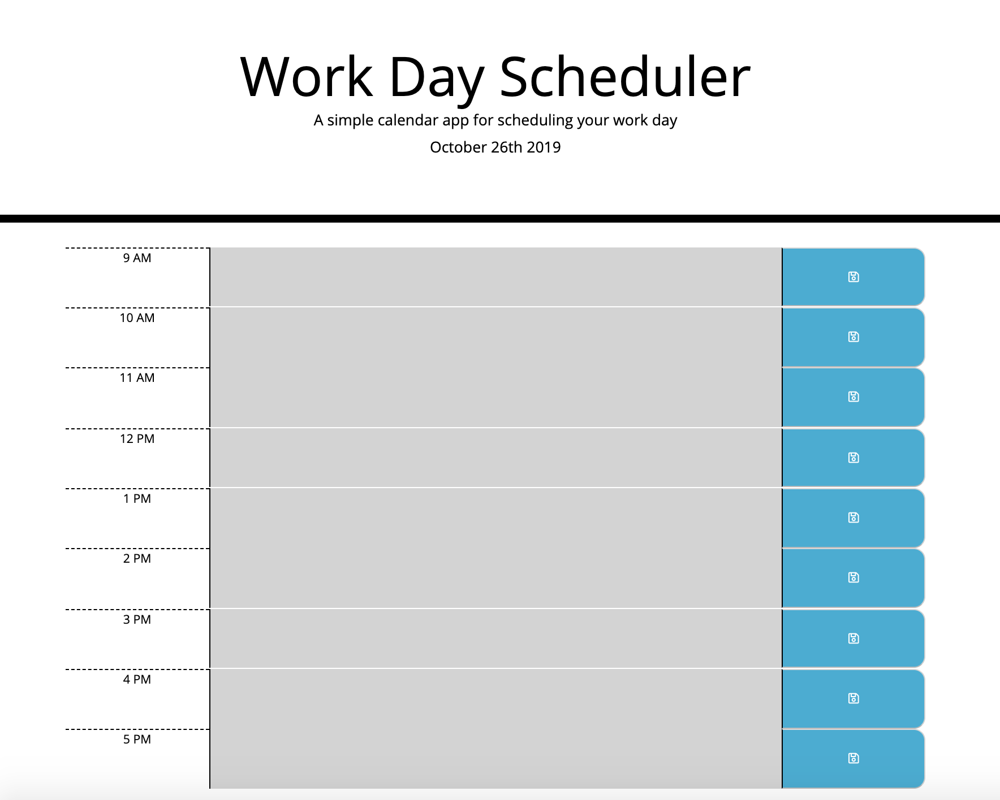

# Day-Planner
Simple Calendar Application that allows the user to save events for each hour of the day.

## Assignment 5 : UofT Cooding Bootcamp

## Preview 
     

 
## Languages Used 

* HTML 
* CSS
* Javascript

## Libraries used 

* JQuery 
* Bootstrap
* Moment.js

